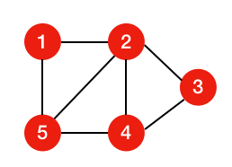
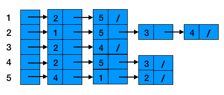
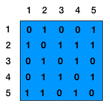

# 图

- [x] 图的相关概念介绍
- [ ] 图的算法实现
- [ ] 图的遍历
- [ ] 最小生成树
- [ ] 最短路径

### 图的相关概念介绍

- 图: 图是由顶点以及顶点见的关系集合组成的一种数据结构
- 路径: 所有顶点都由边连接构成；路径长度为第一个定点到最后一个顶点之间的数量
- 环: 指向自身的顶点，长度为0
- 有向图: 顶点x到顶点y是一条有向边
- 无向图: 顶点x到顶点y是一条无向边
- 连通图: 在无向图中，若从顶点x到顶点y有路径，则称顶点v1和v2是连通的。如果图中的任意一对顶点都是连通的，则称连通图
- 生成树: 一个无向连通图的生成树是它的极小连通子图
- 稀疏图和稠密图: 有很少条边或弧（边的条数E远小于$V^2$）的图称为稀疏图, 反之称为稠密图


### 图的表示方式

图的表示方式有两种

- 邻接表:领接表保存各个顶点所连接的其他顶点的信息, 适用于稀疏图
- 邻接矩阵: 将所有顶点的信息组织成一个顶点表，然后利用一个矩阵来表示各顶点之间的邻接关系,称为邻接矩阵，适用于稠密图

假设无向图如下


则用邻接表表示为


邻接表表示由一个包含n条链表的数组adj组成，每个节点有一条链表。对于每个节点v，邻接链表adj[v]包含所有与节点v之间有边相连的节点u。代码中，数组adj将作为图的一个属性，记录着各个节点之间的连接关系。所以上图中的关系用adj可以表示为

```javascript
[[2, 5], [1, 3, 4, 5], [2, 4], [2, 3, 5], [1, 2, 4]]
```
但是对于邻接表来说却有一个缺陷，无法快速判断一条边(u, v)是否在图中。唯一的办法就是搜索adj[u]是否含有v，邻接矩阵则克服了这个缺陷，但会占用更大的空间。

上面的无向图用邻接矩阵表示为

对于邻接矩阵来说，我们通常会将图中的节点编号，形成一个二维数组g。若某两个节点i和j存在一条边，则`g[i][j]=g[j][i]1`,若是一条有向边从i到j，则只有`g[i][j]=1`，无边则表示为0。对于判断一条边(u, v)是否在图中，可以快速判断`g[u][v]`是否为1。

同时我们也观察到无向图的邻接矩阵其实是一个对称矩阵。由于在无向图中，边(u, v)和边(v, u)是同一条边，无向图的邻接矩阵就是自己的转置

### 图的遍历

* 深度优先搜索(DFS)
  * 1.将待访问的节点标记为已访问
  * 2.遍历与要访问的节点关联的节点数组, 如果关联的节点未被访问过则从步骤1重新开始,直到所有节点都被访问过

* 广度优先搜索(BFS)
  * 1.将起始节点放入队列中
  * 2.删除队列中的第一个元素, 将删除的元素标记为已访问
  * 3.在队列中放入删除元素关联的且未被访问的所有节点
  * 4.重复步骤2和3, 直到队列为空

> BFS求出了无权图的最短路劲